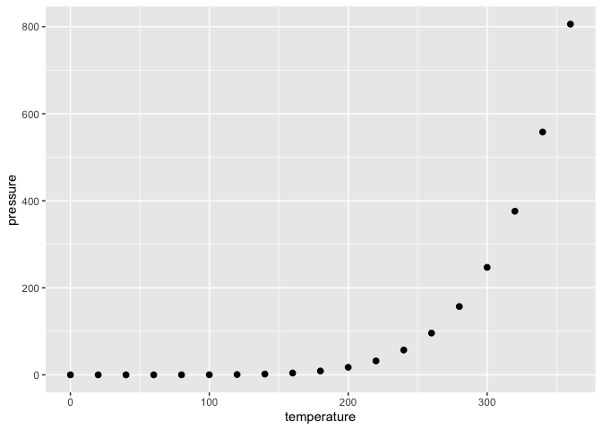

README
================

### About Me

Hi, I’m Bix. I am currently a Student at Northampton High School. I have
some basic knowledge of both R studio, and Python.

### Heres a ggplot!

This maps the pressure of some space, based off of the temperature of
that space

<!-- -->
